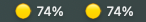

# Claude Code Usage Monitor

A minimal macOS menu bar app to track your Claude Code Pro/Max usage limits.

  



## Why?

- **Simple**: ~150 lines of Python. No bloat.
- **Just Claude Code**: Tracks only Claude Code terminal usage (Pro $20 / Max $100 / Max $200 plans)
- **No keychain loops**: Uses the same credentials as Claude Code CLI without permission conflicts

Built as a lightweight alternative for those who just want Claude Code tracking without multi-tool complexity.

## Features

- 🟢🟡🟠🔴 Color-coded usage indicator in menu bar
- Shows 5-hour and weekly usage percentages
- Displays reset times ("resets in 2h 34m")
- macOS notifications at 85% and 95% usage
- Auto-starts at login (optional)
- Updates every 2 minutes

## Requirements

- macOS
- Python 3.8+
- Claude Code CLI (authenticated)

## Installation

```bash
git clone https://github.com/YOUR_USERNAME/usage-watcher.git
cd usage-watcher
./setup.sh
```

The setup will:
1. Create a virtual environment
2. Install dependencies
3. Ask if you want auto-start at login
4. Offer to start immediately

## Usage

Once running, you'll see an icon in your menu bar:

| Icon | Meaning |
|------|---------|
| 🟢 45% | Healthy (under 70%) |
| 🟡 75% | Warning (70-85%) |
| 🟠 88% | High (85-95%) - notification sent |
| 🔴 96% | Critical (95%+) - urgent notification |

Click the icon to see:
- Exact 5h and weekly percentages
- Reset times
- Last update time
- Manual refresh option

## Uninstall

```bash
./uninstall.sh
```

## How It Works

1. Reads OAuth token from macOS Keychain (`Claude Code-credentials`)
2. Calls Anthropic's usage API every 2 minutes
3. Displays usage in menu bar with color coding
4. Sends macOS notifications when approaching limits

## Troubleshooting

**"Authentication Required" notification**

Run `claude` in terminal first to authenticate. The app reads the same credentials Claude Code uses.

**App not starting at login**

Re-run `./setup.sh` and select "y" for auto-start.

**Want to change poll interval or thresholds**

Edit the constants at the top of `claude_usage.py`:

```python
POLL_INTERVAL = 120  # seconds
THRESHOLDS = {
    'warning': 0.70,
    'danger': 0.85,
    'critical': 0.95
}
```

## Credits

Inspired by [CodexBar](https://github.com/steipete/CodexBar) - a more full-featured multi-tool usage tracker.

## License

MIT
